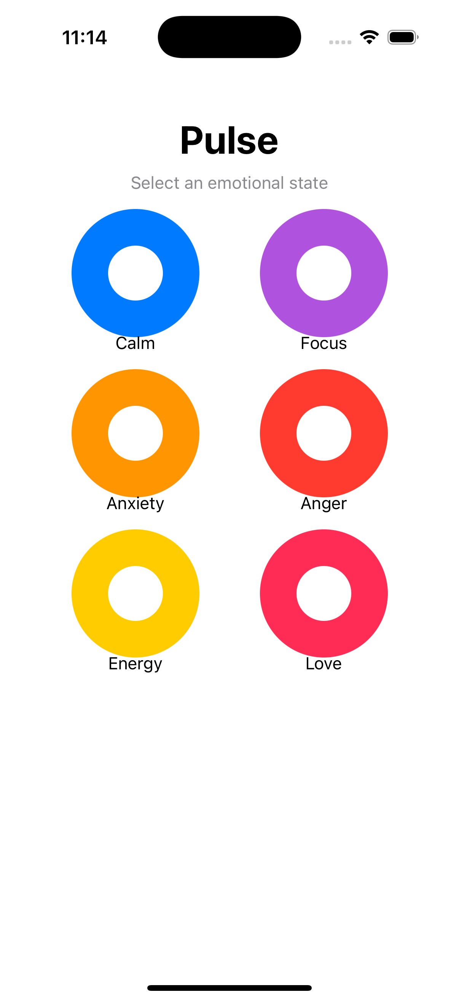
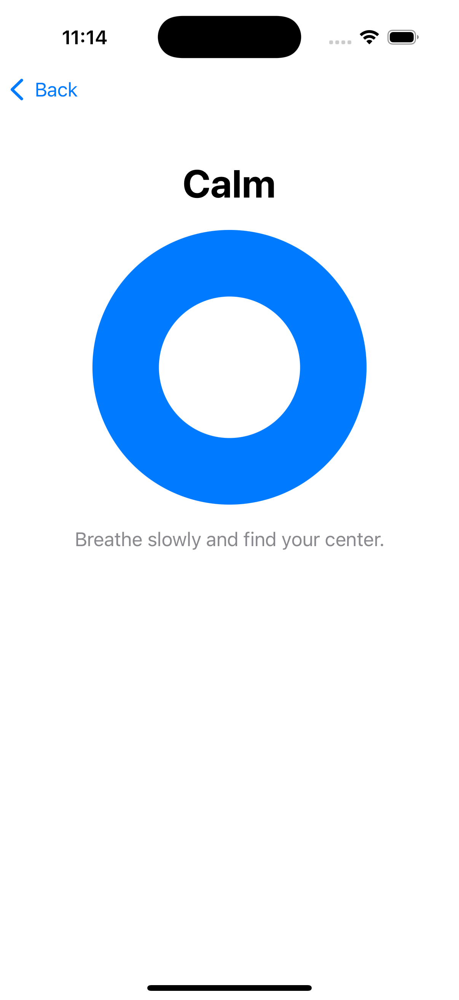

# Pulse

A demo app exploring how animation and color can create emotional resonance through simple, focused interactions.

|  |  |  |
|:---:|:---:|:---:|

## What This Is

Pulse is a prototype that demonstrates how subtle visual rhythms can help people connect with and regulate their emotional states. The core idea is straightforward: select an emotion, watch it breathe, and let the animation guide your own breathing.

This isn't a production app—it's a focused exploration of how we can use motion and color to create meaningful moments of pause and reflection.

## The Experience

The app presents six emotional states, each with its own visual language:

- **Calm** - Slow, steady breathing in blue. The kind of rhythm that helps you settle.
- **Focus** - Medium-paced purple pulses that help channel attention.
- **Anxiety** - Starts fast and orange, then gradually slows and shifts to blue over ~20 seconds. The animation itself becomes a tool for regulation.
- **Anger** - Sharp, quick pulses in red that intensify to burnt orange at peak. The visual matches the intensity.
- **Energy** - Bright yellow pulses at a steady, invigorating pace.
- **Love** - A heartbeat pattern in pink. Two quick pulses followed by a pause, just like a real heartbeat.

Each emotion has its own rhythm, color, and pacing. The animations aren't just decorative—they're designed to be followed, to sync with your own breathing, to create a moment of presence.

## Technical Approach

Built with SwiftUI using a clean MVVM architecture. No external dependencies, no networking, no persistence. Just focused code that does one thing well.

The animations are all custom-built using SwiftUI's animation system. Each emotion has its own timing curve and duration, carefully tuned to create the right feeling. The Anxiety animation is particularly interesting—it uses a separate timer to gradually morph both the color and speed over 20 seconds, creating a visual metaphor for emotional regulation.

The code is organized simply: models define the emotions, view models manage state, and views handle presentation. Nothing fancy, just clear separation of concerns that makes the code easy to understand and modify.

## Why This Matters

In a world full of apps that demand attention, Pulse asks for something different: a moment to breathe, to notice how you're feeling, to let a simple animation guide you back to center.

The Anxiety animation is a good example of what we're exploring here. It doesn't just represent anxiety—it actively helps regulate it. The fast, urgent pulse at the start gradually slows and cools, creating a visual guide for your own nervous system to follow.

This is early work, but it points toward something important: technology that doesn't just inform or entertain, but actually helps us feel better.

## Running the Project

Open `PulseAnimationsDemo.xcodeproj` in Xcode and run on a simulator or device. Requires iOS 17+ (for NavigationStack).

## What's Next

This is a demo, so there's plenty of room to explore. Some directions that feel interesting:

- More nuanced animation curves that better match the feeling of each emotion
- Haptic feedback synced with the pulse
- Customizable durations and colors
- Guided breathing sessions tied to specific emotions
- More sophisticated color transitions

But for now, this is enough. A simple app that asks you to pause, to breathe, to notice how you're feeling. Sometimes that's exactly what we need.

